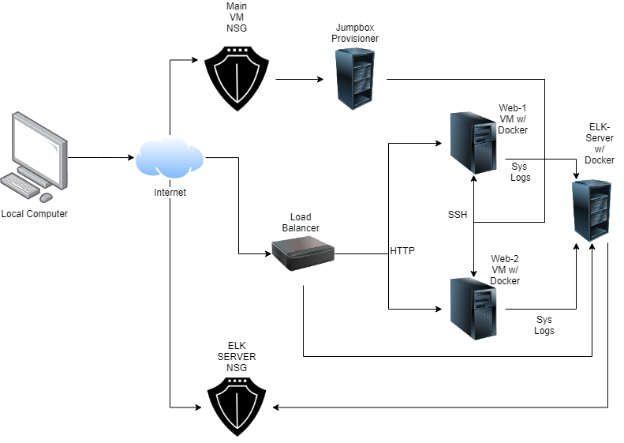
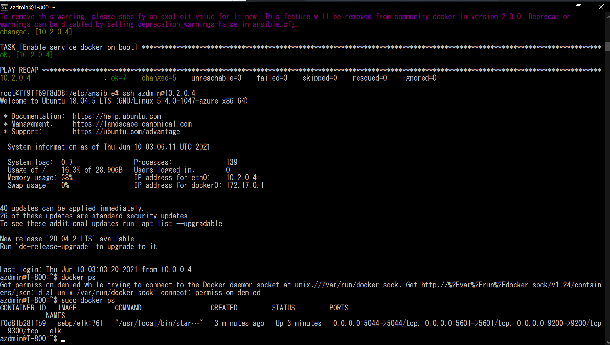

# UCSD_Bootcamp
## Automated ELK Stack Deployment

The files in this repository were used to configure the network depicted below.

These files have been tested and used to generate a live ELK deployment on Azure. They can be used to either recreate the entire deployment pictured above. Alternatively, select portions of the _____ file may be used to install only certain pieces of it, such as Filebeat.

 

This document contains the following details:
- Description of the Topologu
- Access Policies
- ELK Configuration
  - Beats in Use
  - Machines Being Monitored
- How to Use the Ansible Build

### Description of the Topology

The main purpose of this network is to expose a load-balanced and monitored instance of DVWA, the D*mn Vulnerable Web Application.

Load balancing ensures that the application will be highly stable, in addition to restricting access to the network.
- _TODO: What aspect of security do load balancers protect? What is the advantage of a jump box?_
	A load balencer can protect against attacks like DDoS by redirecting unwanted traffic towards another server on a cloud.

Integrating an ELK server allows users to easily monitor the vulnerable VMs for changes to the systems metrics and system logs.
- _TODO: What does Filebeat watch for?_
	Filebeat can watch out for "event data" in specified logs by the user. It then fowards them to software like Kibana for indexing.
- _TODO: What does Metricbeat record?_
	Metricbeat can monitor system metrics and other runing services such as Apache or MySQL

The configuration details of each machine may be found below.
_Note: Use the [Markdown Table Generator](http://www.tablesgenerator.com/markdown_tables) to add/remove values from the table_.

| Name     | Function  | IP Address | Operating System |
|----------|-----------|------------|------------------|
| Jump-Box | Gateway   | 10.0.0.4   | Linux            |
| Web-1    | Container | 10.0.0.8   | Linux            |
| Web-2    | Container | 10.0.0.6   | Linux            |
| T-800    | ELK       | 10.2.0.4   | Linux            |

### Access Policies

The machines on the internal network are not exposed to the public Internet.

Only the Jump-Box machine can accept connections from the Internet. Access to this machine is only allowed from the following IP addresses:
	I currenly have the IP Address 72.220.3.92 whitelisted so I may ssh into the Jump Box Machine	 

Machines within the network can only be accessed by users with the right ssh key.
- _TODO: Which machine did you allow to access your ELK VM? What was its IP address?_
	My Jumpbox Machine. IP Address (52.250.23.216 | 10.0.0.4)
A summary of the access policies in place can be found in the table below.

| Name     | Publicly Accessible | Allowed IP Addresses | Operating System |
|----------|---------------------|----------------------|------------------|
| Jump-Box | yes                 | 72.220.3.92          | Linux            |
| Web-1    | no                  | 10.0.0.4             | Linux            |
| Web-2    | no                  | 10.0.0.4             | Linux            |
| T-800    | no                  | 52.250.23.216        | Linux            |

### Elk Configuration

Ansible was used to automate configuration of the ELK machine. No configuration was performed manually, which is advantageous because...
- _TODO: What is the main advantage of automating configuration with Ansible?_
	Why type a thousand keys when a 15 letter name for a script could deploy everything for you? The automation process would make repeating tasks go a lot more smoother 
The playbook implements the following tasks:
- _TODO: In 3-5 bullets, explain the steps of the ELK installation play. E.g., install Docker; download image; etc._
	*install docker.io, pip3, and the Docker Python Module
	*Configure a VM to use more memory by setting the vm.max_map_count to 262144
	*Downloads and installs the Docker container called sebp/elk:761
		-make sure the docker container start with these port mappings
			--5601:5601
			--9200:9200
			--5044:5044
	*Start the Container
	*Enable the Docker service on boot
 

The following screenshot displays the result of running `docker ps` after successfully configuring the ELK instance.

### Target Machines & Beats
This ELK server is configured to monitor the following machines:
- _TODO: List the IP addresses of the machines you are monitoring_
	Web-1 10.0.0.8
	Web-2 10.0.0.6	
We have installed the following Beats on these machines:
- _TODO: Specify which Beats you successfully installed_
	We have installed Filebeat and Metricbeat

These Beats allow us to collect the following information from each machine:
- _TODO: In 1-2 sentences, explain what kind of data each beat collects, and provide 1 example of what you expect to see. E.g., `Winlogbeat` collects Windows logs, which we use to track user logon events, etc._
	The names should kind of give this away. The Filebeat monitors the systems log flies or something similar that the user and specified. Metricbeat collects data on the systems metrics, possibly on memory usage, cpu info, or OS verision
### Using the Playbook
In order to use the playbook, you will need to have an Ansible control node already configured. Assuming you have such a control node provisioned:

SSH into the control node and follow the steps below:
- Copy the filebeat-config.yml file to etc/ansible/files.
- Update the filebeat-config.yml file to include the IP's of your ELK machine
- Run the playbook, and navigate to http://(YOUR_ELK_MACHINE_IP):5601/app/kibana to check that the installation worked as expected.

_TODO: Answer the following questions to fill in the blanks:_
- _Which file is the playbook? Where do you copy it?_
	The playbook should be called filebeat-playbook.yml which is found in /etc/ansible/hosts

- _Which file do you update to make Ansible run the playbook on a specific machine? How do I specify which machine to install the ELK server on versus which to install Filebeat on?_
	You should update the host file found in etc/ansible/hosts. There's a group within that file called webservers where you place your machines IP's into the group and create an ELK group with your elk machines IP in that group. 
	There's a string of code that should be on the tail end of each command that will look like ansible_python_interpreter=/usr/bin/python3
- _Which URL do you navigate to in order to check that the ELK server is running?
	http://(YOUR_ELK_MACHINE_IP):5601/app/kibana
